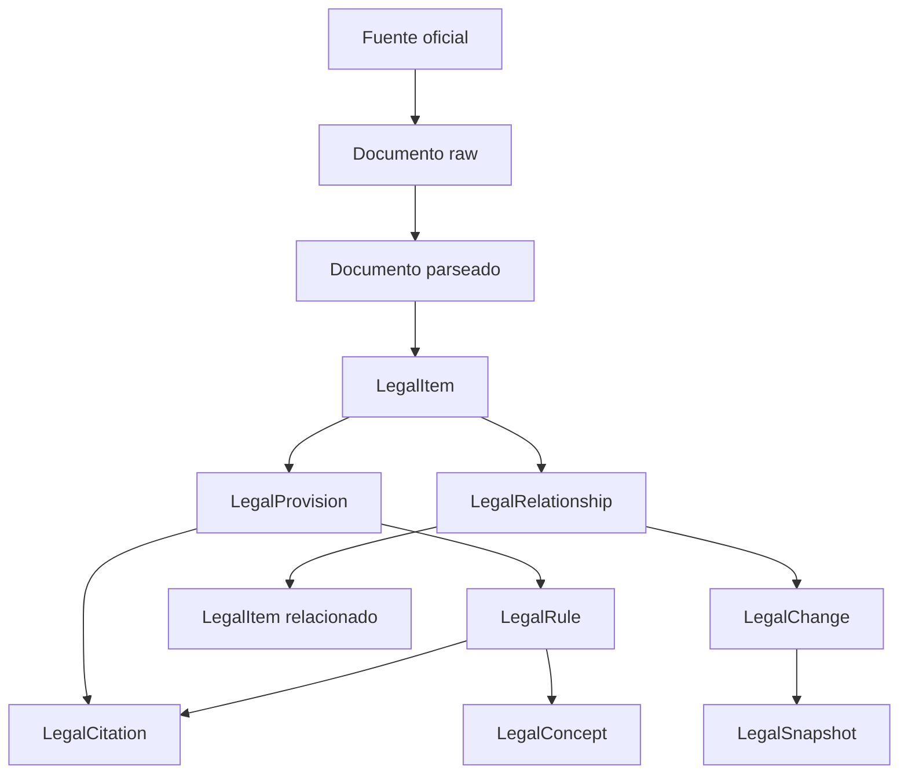
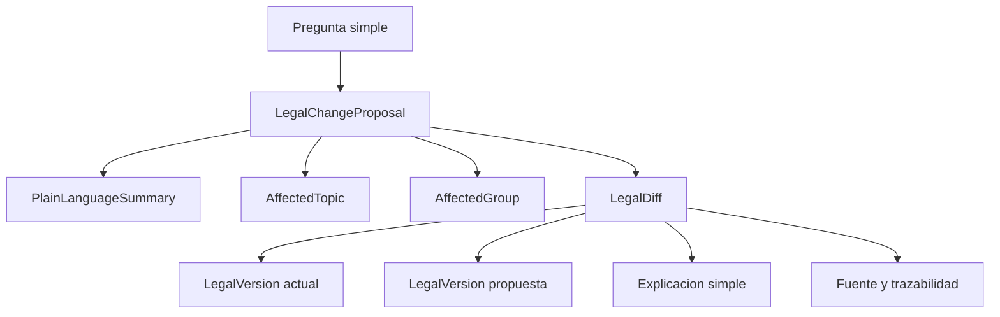

# Mapeo de conceptos legales a objetos

Este documento explica como LexMapa transforma conceptos legales reales en contratos auditables.



## Mapeo MVP de cambios legales

El MVP prioriza una experiencia de comparacion legal antes que una vista
normativa completa.



Este mapeo responde preguntas como:

```text
que se trata sobre Ley Hojarasca
que pasa con biocombustibles
que se trata sobre el Parque Marino Monte Leon
```

## Tabla de mapeo

| Concepto legal real | Contrato |
|---|---|
| Ley, decreto, resolucion, fallo, proyecto | `LegalItem` |
| Articulo, inciso, parrafo, anexo | `LegalProvision` |
| Obligacion, prohibicion, derecho, sancion | `LegalRule` |
| Consumidor, proveedor, dato personal | `LegalConcept` |
| Modifica, deroga, reglamenta, interpreta | `LegalRelationship` |
| Cambio normativo o semantico | `LegalChange` |
| Version en una fecha | `LegalSnapshot` |
| Fuente exacta | `LegalCitation` |
| Reforma, propuesta o paquete de cambios | `LegalChangeProposal` |
| Texto actual o texto propuesto | `LegalVersion` |
| Comparacion puntual entre versiones | `LegalDiff` |
| Tema afectado explicado en simple | `AffectedTopic` |
| Grupo impactado explicado en simple | `AffectedGroup` |
| Resumen para personas no juridicas | `PlainLanguageSummary` |

## Regla de trazabilidad

Todo dato interpretado debe poder navegar hacia:

```text
explicacion
-> objeto
-> cita exacta
-> fuente oficial
-> estado de revision
-> nivel de confianza
```
