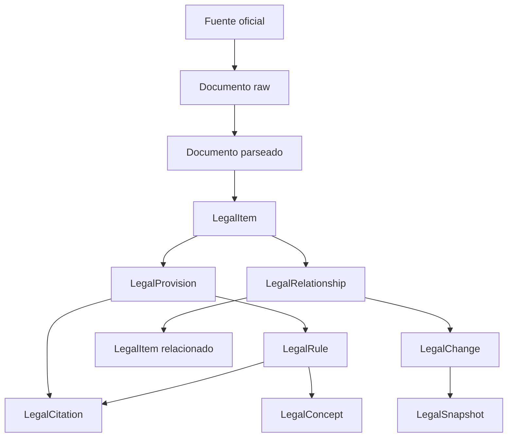

# Mapeo de conceptos legales a objetos

Este documento explica como LexMapa transforma conceptos legales reales en contratos auditables.



## Tabla de mapeo

| Concepto legal real | Contrato |
|---|---|
| Ley, decreto, resolucion, fallo, proyecto | `LegalItem` |
| Articulo, inciso, parrafo, anexo | `LegalProvision` |
| Obligacion, prohibicion, derecho, sancion | `LegalRule` |
| Consumidor, proveedor, dato personal | `LegalConcept` |
| Modifica, deroga, reglamenta, interpreta | `LegalRelationship` |
| Cambio normativo o semantico | `LegalChange` |
| Version en una fecha | `LegalSnapshot` |
| Fuente exacta | `LegalCitation` |

## Regla de trazabilidad

Todo dato interpretado debe poder navegar hacia:

```text
explicacion
-> objeto
-> cita exacta
-> fuente oficial
-> estado de revision
-> nivel de confianza
```

